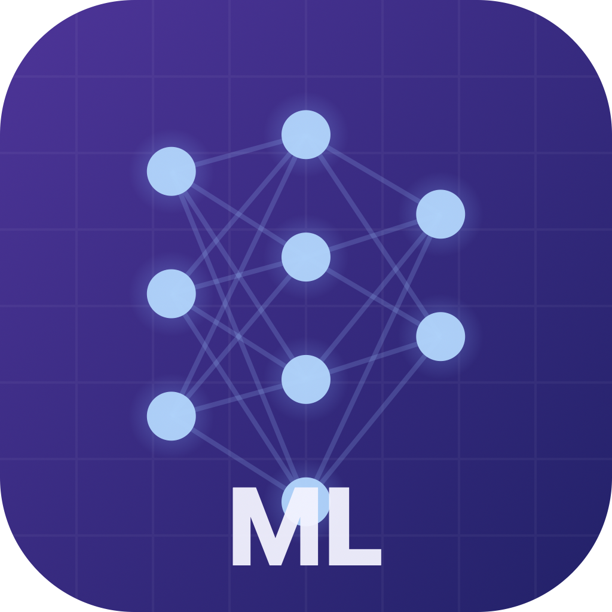

<p align="center">
  
</p>

<h1 align="center">ML Practice</h1>

<p align="center">
  ML 인터뷰 준비를 위한 macOS 앱.<br>
  하루에 N개의 문제를 push 받아 자기 테스트하고, Claude Code로 피드백을 받을 수 있습니다.
</p>

## Features

- **Daily Quiz**: 매일 설정한 수만큼 문제를 자동 배정 (in-progress 우선)
- **Progress Tracking**: 문제별 상태 관리 (Unsolved / In Progress / Solved)
- **Syntax Highlighted Editor**: Python 코드를 컬러 하이라이팅으로 편집 (Reference + Scratch Pad)
- **Claude Code Integration**: 코드 선택 후 Cmd+L로 인라인 질문, Markdown 렌더링 응답
- **Python Venv Support**: pyenv 가상환경 자동 감지 및 선택
- **Dashboard**: 카테고리별 진행률, 동기부여 메시지
- **Daily Notifications**: 설정한 시간에 macOS 알림

## Build & Run

```bash
cd ml-practice-app
bash build.sh
open '.build/ML Practice.app'
```

### Install to Applications

```bash
cp -r '.build/ML Practice.app' /Applications/
```

Launchpad이나 Spotlight에서 "ML Practice"로 검색하여 실행할 수 있습니다.

## First Launch

1. 앱 실행 시 "Choose Directory..." 버튼 클릭
2. `implementation-practice/` 폴더 선택
3. 자동으로 문제 목록 로드 + 오늘의 문제 배정

## Usage

- **사이드바**: Today's Practice (오늘의 문제) + 카테고리별 전체 문제
- **코드 에디터**: Reference (원본 코드) / Scratch Pad (풀이 작성) 탭 전환
- **Python 실행**: Cmd+R로 현재 파일 실행, 헤더에서 가상환경 선택 가능
- **Claude 피드백**: 
  - 코드 선택 후 **Cmd+L** → 인라인 채팅 팝업
  - 오른쪽 Claude 패널에서 Context(No Code / Selection / Full Code) 선택 후 질문
  - 응답은 Markdown으로 렌더링 (코드 하이라이팅 포함)
- **상태 변경**: 문제별로 Unsolved / In Progress / Solved 토글
- **Settings** (Cmd+,): 하루 문제 수, 알림 시간, Python 환경 설정

## Keyboard Shortcuts

| Shortcut | Action |
|----------|--------|
| Cmd+R | Python 파일 실행 |
| Cmd+S | 파일 저장 |
| Cmd+L | 인라인 Claude 채팅 |
| Cmd+Enter | Claude에 질문 전송 |

## Requirements

- macOS 14 (Sonoma) 이상
- Swift 5.9+
- [Claude Code](https://claude.ai/claude-code) (피드백 기능 사용 시)
